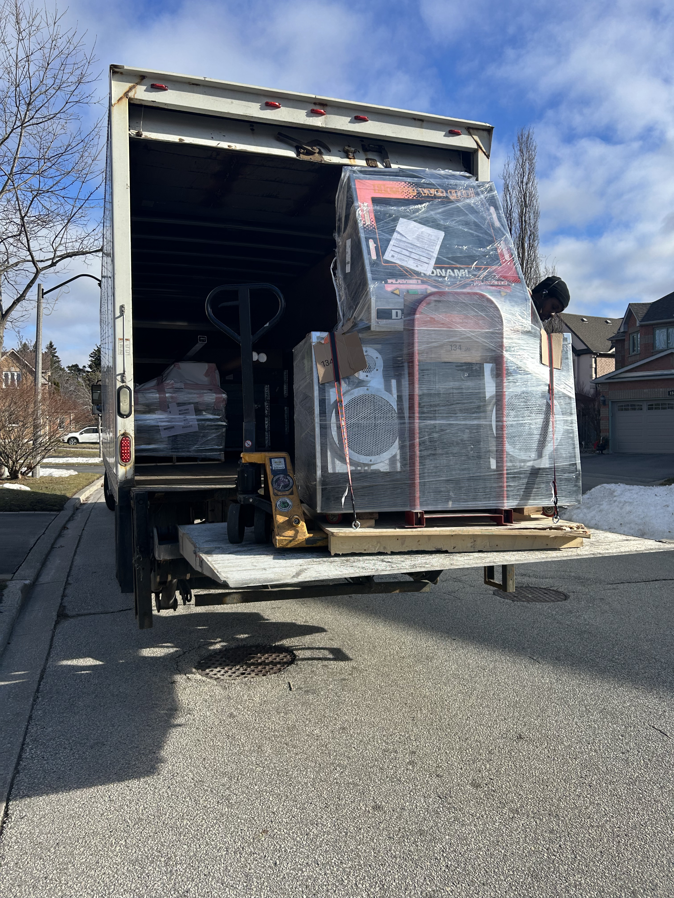
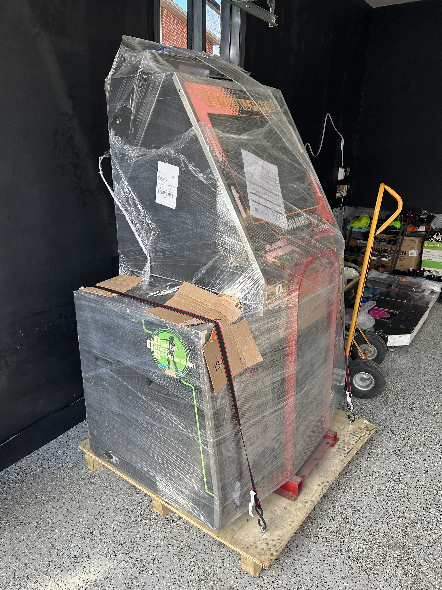
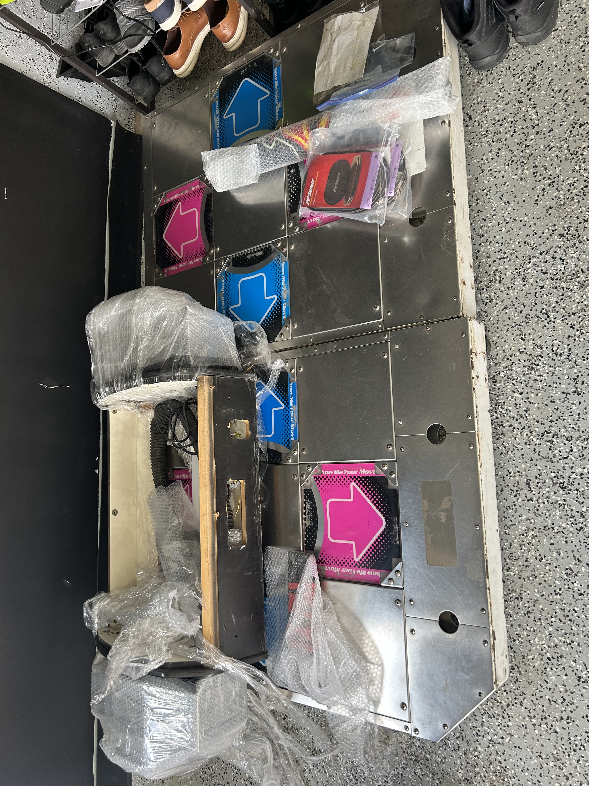
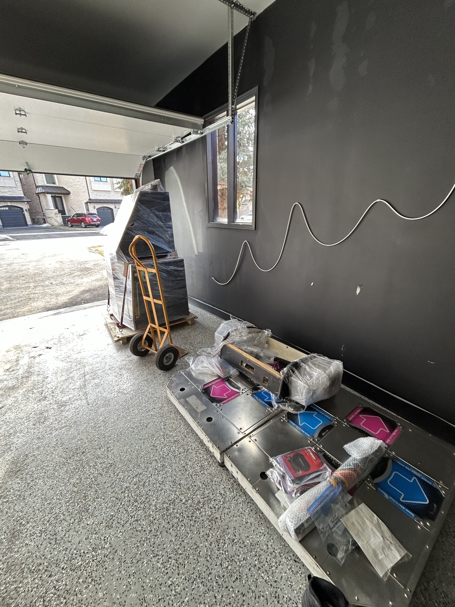
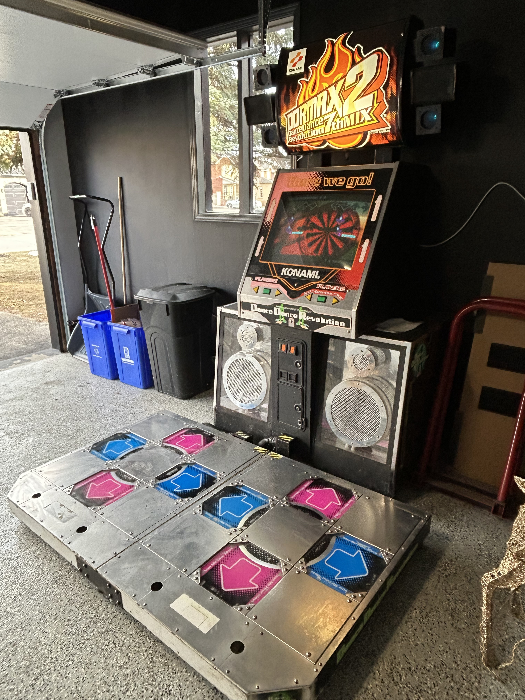
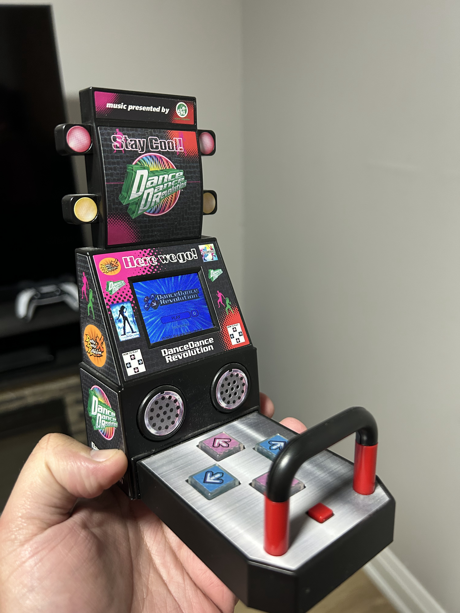

I'd wanted a DDR arcade cabinet at home for a long time. Everyone who played in arcades back then had that fantasy. Having a basement (or so I thought) and a garage made it feel slightly less ridiculous as an adult.

Still took years to find one. I'd poke around every so often, check listings, talk myself out of it, repeat. Nothing was ever close. Rent a U-Haul and drive to the US, or pay freight on something you can't inspect first.

## Finding one

I spotted a listing on Facebook Marketplace in Winnipeg. First time I'd used Marketplace for something like this. Hard to know what you're buying when you can't walk up and actually look at it.

The seller sent detailed photos and videos, which helped. Enough that I felt okay arranging shipping, which was also a first. Truck freight from Winnipeg to Pickering, Ontario took about two or three days.

## Delivery day

It showed up on a flatbed, packed into two large skids. About 1000 lbs total: roughly 500 for the cabinet, 250 for each pad. Very heavy is the main thing I remember.

My neighbor was around that day and is pretty handy with tools. I would not have wanted to unpack and move this solo. We got it off the truck, cut the wrap, and started figuring out where everything went.

Original plan was the basement. That died once we measured the door. The cabinet would have to come apart completely to fit through, and I wasn't doing a full strip-down in the driveway on day one. We reshuffled the garage, checked car park clearance, and made a spot work.

Nothing showed up damaged from shipping, which was the other thing I was worried about. Just a lot of dragging, pad removal, cable routing, and wondering if we had it facing the right way.

## Assembly

Reassembly took longer than the delivery. Pads back on, marquee seated, power and IO hooked up to the 573. I'd taken photos of the cable routing before anything got disconnected. That saved some guessing.

I have a toy DDR cabinet on a shelf in my entertainment unit. Same general shape, very different scale. Still kind of in shock that I actually owned the real thing.

Truck arrival to first boot was maybe three or four hours. Felt longer.

::: {.callout-note .video-callout icon="false"}

## First boot



:::

Attract mode came up. Pads registered. CRT took a minute to warm up. I played a few songs on **DDRMAX 2** and called it a night.

Found out later it was a Korean cabinet (KCAB). Something you're probably supposed to confirm before you buy. Same as the basement door, honestly. I'd figure out the details later. The hard part was finding the machine. These cabs are 25+ years old at this point and rare. Everything else felt secondary.

The rest of this [series](../) is what happened after: upgrades, maintenance, and figuring out how to actually own one of these.

::: {.series-nav}

::: {.series-prev}
:::

::: {.series-next}
[Next: Vol 2: Software Upgrades](../software-upgrades/)
:::

[All personal notes](../)

:::
