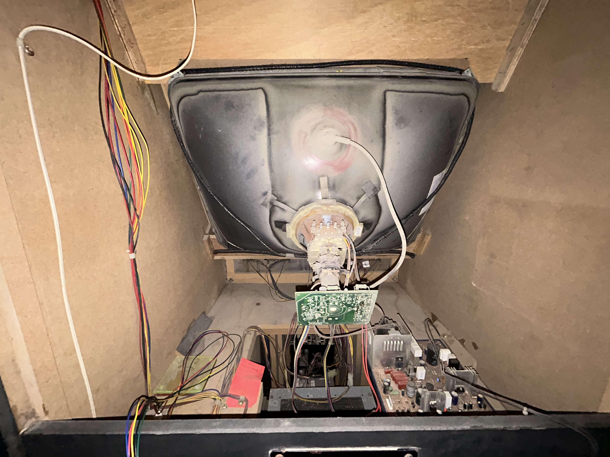
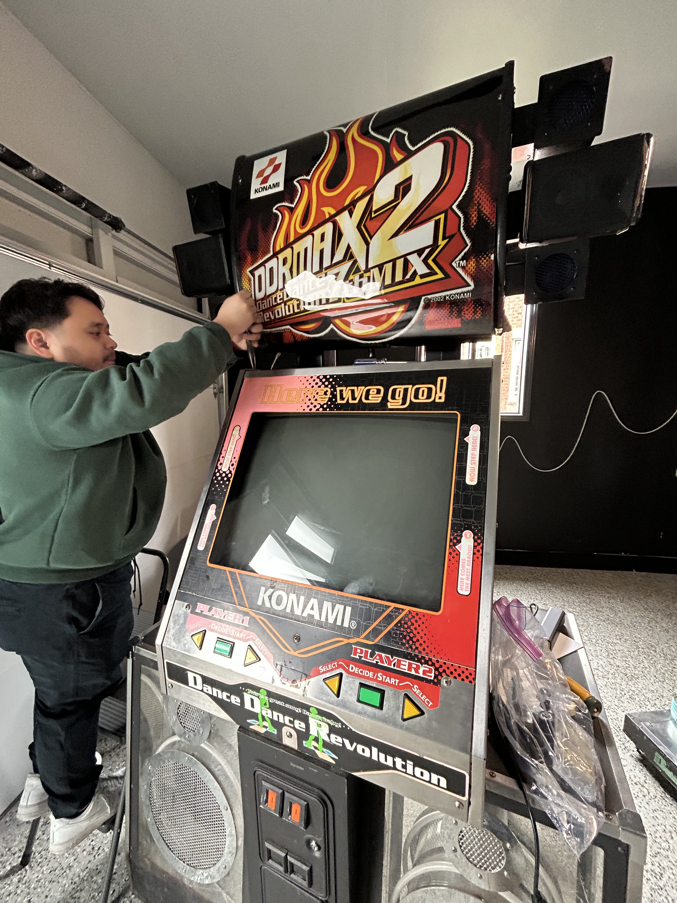
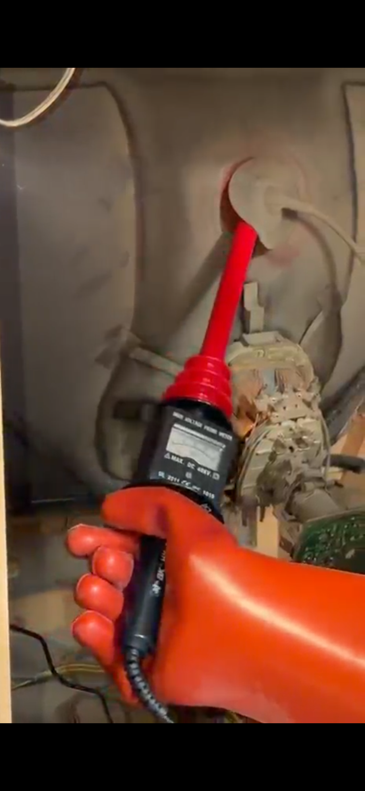
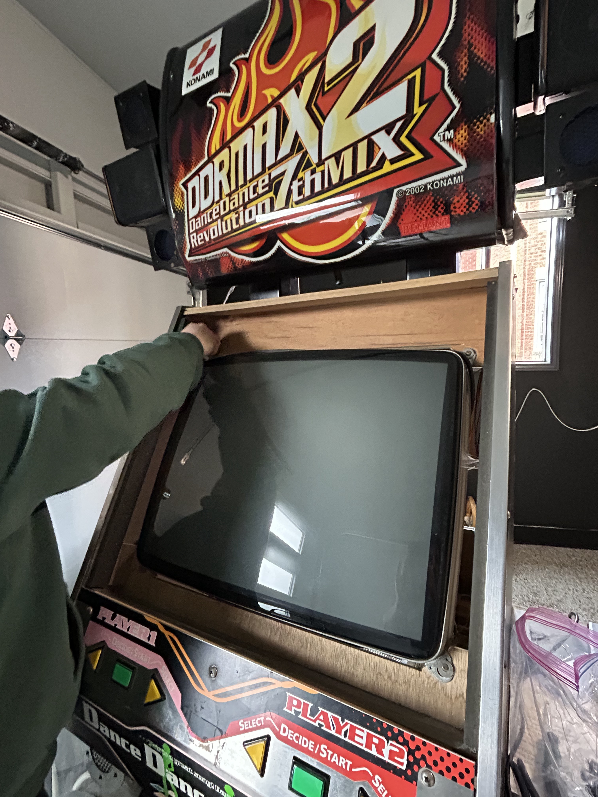
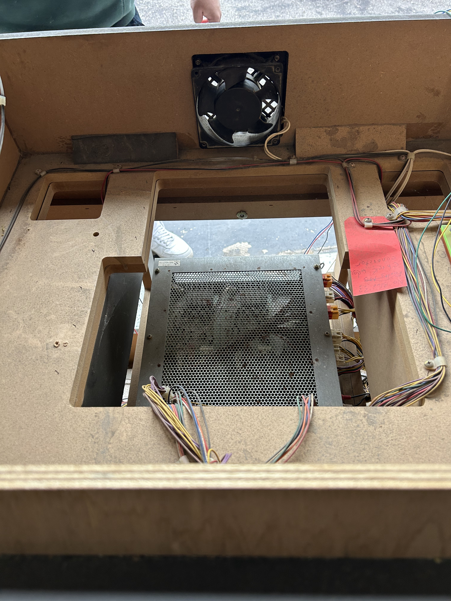
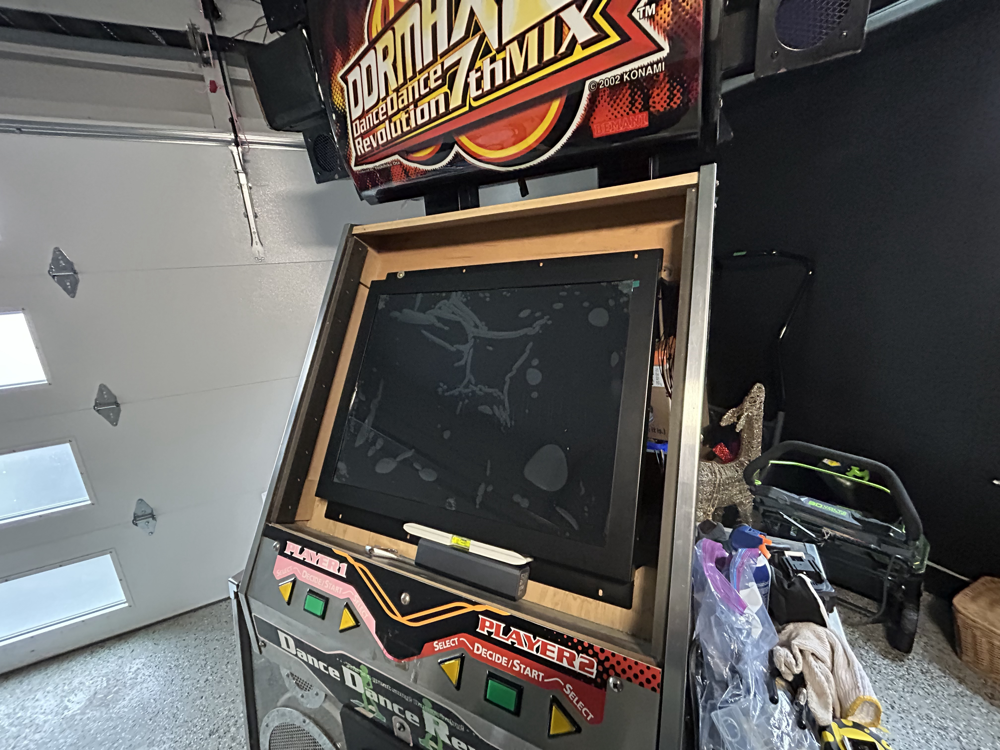
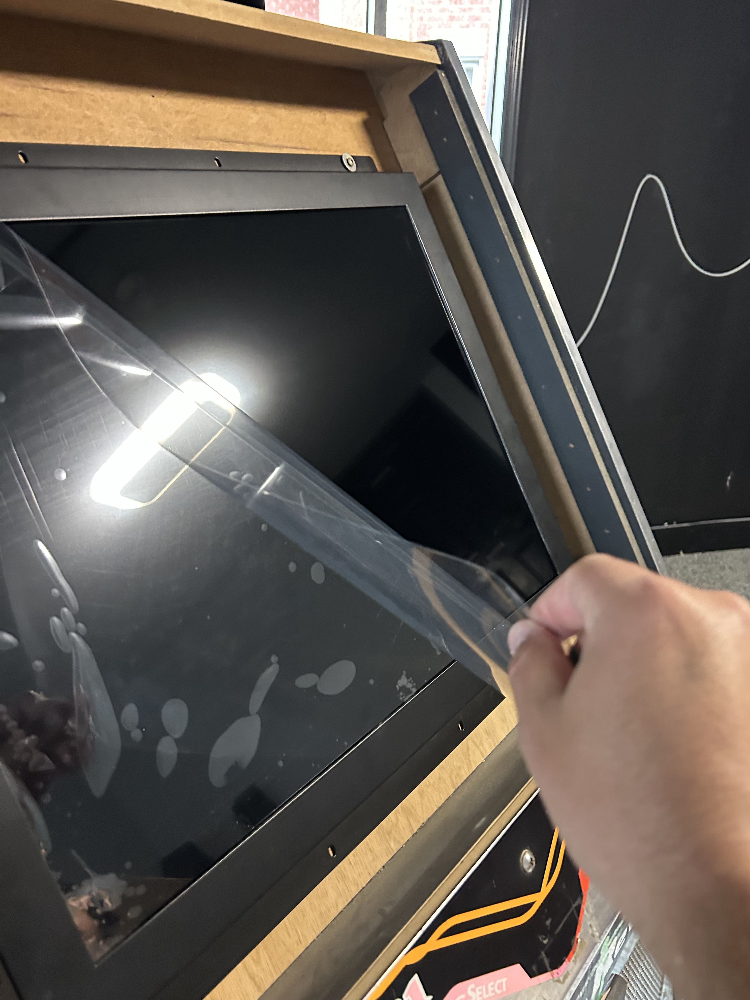
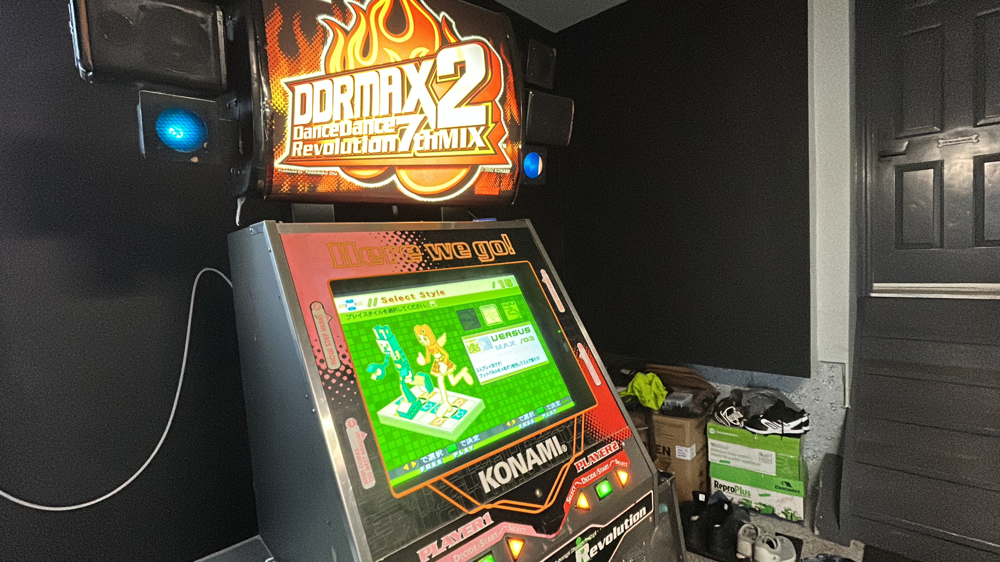

::: {.column-margin}
## What I bought

- [Arcooda 26″ 4:3 retro gaming LCD](https://ddrpad.com/en-ca/collections/arcade-parts/products/26-inch-4-3-ratio-arcooda-retro-gaming-lcd-monitor)
- [B&K Precision HV-44A high voltage probe](https://www.digikey.com/en/products/detail/b-k-precision/HV-44A/268972)
- [12KV insulating rubber gloves](https://www.amazon.ca/dp/B01IVKJEYS)
:::

First real problem as an arcade owner: the CRT stopped showing a picture. Random one day. I could still hear game audio and see the cabinet lights flash, so I was pretty sure the 573 was fine. The monitor was not.

Had a few friends who know their way around electronics take a look. Nothing obvious. Called a couple local repair shops. No callbacks. Things were looking grim.

## Finding a replacement

Turns out **ddrpad.com** sells an LCD drop-in made for this. Not a random TV panel. The 573 wants a 15 kHz signal, which is weirdly specific and rules out most modern displays without extra conversion hardware. The **Arcooda** panel handles that natively. First bit of luck in a while.

I placed the order. Took about three weeks to arrive. I was in Europe on vacation for most of that wait, which honestly helped. A dead cab at home would have driven me nuts.

While I waited, I went back to reddit and the facebook groups to figure out how CRT removal works on a KCAB. Short version: it comes out through the front. It's heavy. And if you do it wrong, it's dangerous.

## CRT removal

CRTs hold high voltage even unplugged, sometimes for days or weeks. I'd read enough horror stories that I wasn't going to wing the discharge step. Watched [this video](https://www.youtube.com/watch?v=uTwrgbzLvT4) a bunch of times, ordered the probe and gloves, and still felt shaky about the whole thing.

My brother-in-law helped with all of this. I don't think I would have pulled it off alone. Lots of tools, precision, leveling, mounting, and someone willing to share the safety risk. We had EMS on speed dial. Mostly as a joke. Mostly.

On a KCAB there's no metal cage around the tube like on a JCAB. The CRT mounts straight to a piece of wood inside the cab. We pulled panels, plexiglass, and everything else in the way first.

Discharging was the part I was dreading. The machine had been off for almost three weeks, but I'd read that doesn't guarantee anything. We used the HV probe to check for charge first, then slipped it under the anode cap.

::: {.callout-note .video-callout icon="false"}

## Discharging the CRT



:::

No crackle. Probably already bled off on its own, but worth doing anyway.

After that we worked the tube out through the front and set it aside. I'm still not convinced it's actually dead. Could be a loose wire or a cheap component someone who does CRT work could swap in five minutes. Couldn't find anyone in the GTA willing to try. I still have the tube in case that changes.

## Installing the LCD

Mounting the Arcooda panel was the easy part by comparison. Power, signal, tidy the cables, level it, hope for picture. A lot of this know-how came from my brother-in-law's experience!

Picture came up on the first try. Huge relief.

Getting the cab back together after that was the easy part. The LCD looks great in the bezel. Brighter, sharper, way less mass than the tube. Also very glad my brother-in-law stuck around for the scary parts.

::: {.series-nav}

::: {.series-prev}
[Previous: Vol 2: Software Upgrades](../software-upgrades/)
:::

::: {.series-next}
[Next: Vol 4: Pad Upgrades](../pad-upgrades/)
:::

[All personal notes](../)

:::
