::: {.column-margin}
## What I bought

- [L-Bracket spacer for DDR / ITG / PIU pads](https://ddrpad.com/en-ca/collections/arcade-parts/products/l-bracket-spacer-for-ddr-itg-piu)
- [L-Bracket sensitivity foam mod](https://ddrpad.com/en-ca/collections/arcade-parts/products/l-bracket-sensitivity-mod)
- [Manual impact driver set](https://www.amazon.ca/dp/B0D4MJN6D4)
- [M6-1 × 12mm low-profile machine screws (100 pack)](https://www.amazon.ca/dp/B0FNDB4N11)
:::

By this point I was actually using the cab again. New LCD, different mixes, getting back into shape. The weak link was the pads. Panels had started to slide and shift. Felt loose underfoot, and it got worse the more I played.

**ddrpad.com** had two parts that looked like the right fix: replacement foam inserts for the L-brackets, and spacers that hold the brackets tighter. Less slop, better sensor contact, firmer panels. Sounded like a simple weekend job.

I was so wrong.

## Getting the panels off

The first fight was the screws. These pads have been played on for years. Dirt packed into the heads, rust on top of that, threads that did not want to cooperate. Regular screwdriver did nothing. Power drill made things worse by chewing up a few heads.

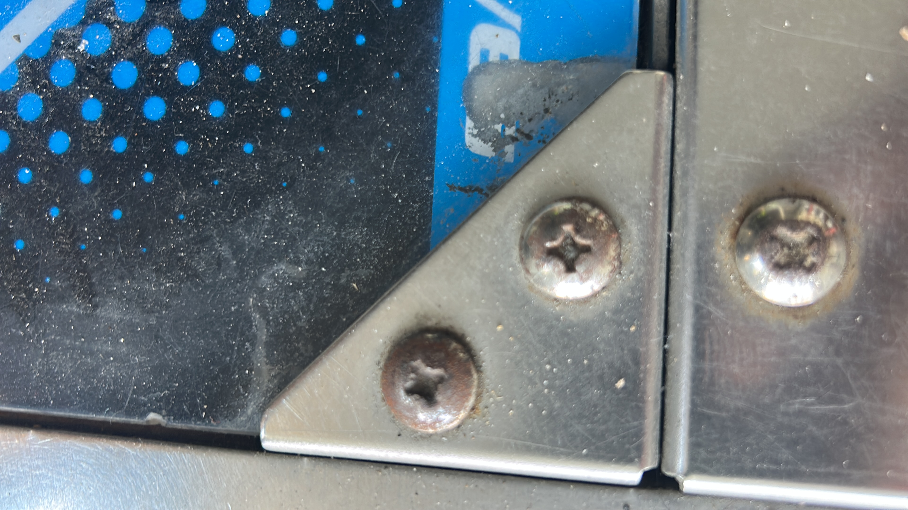

A friend mentioned an impact driver. I'd never heard of one, let alone used one. It's basically a screwdriver you hit with a hammer. Each strike sends a sharp rotational jolt through the bit, which is what you need when a screw is seized. Weirdly satisfying once you get the hang of it. Also beat up my hand a bit if you're not careful with the strikes.

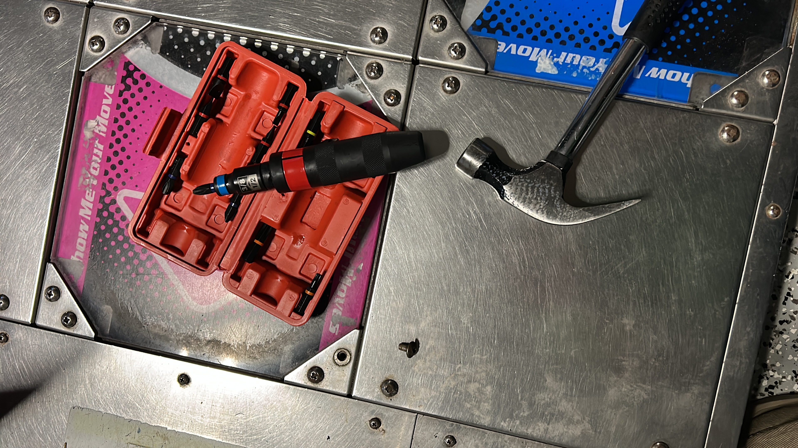

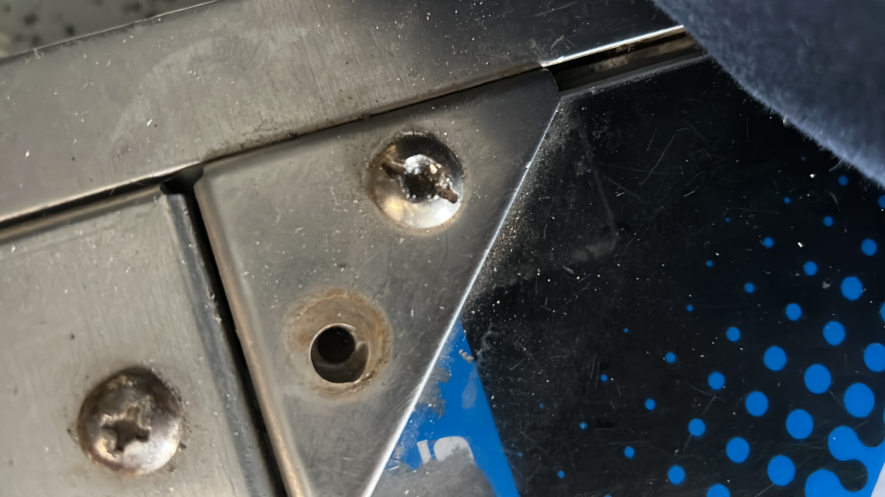

I started with one pad end to end. Most screws came out with the impact driver. A few were still stubborn. My neighbor helped drill through a couple, cut others, and we hit the worst ones with machine oil and patience. First time I'd used machine oil for something like this. Not the same as grabbing WD-40 off the shelf.

Removing the L-brackets carefully took the rest of that weekend by itself.

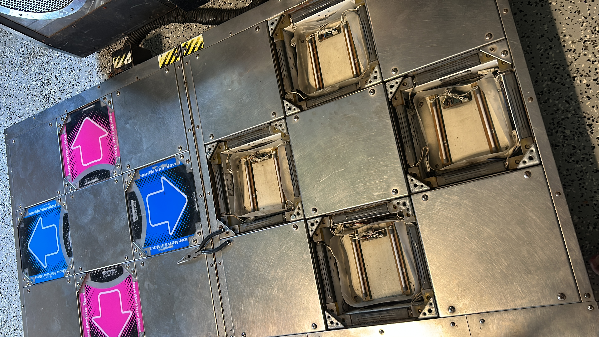

## Cleaning everything

Once everything was off, the cleaning started. Brackets soaked in vinegar, water, and baking soda. Toothbrush on the L-brackets and on every screw I could salvage.

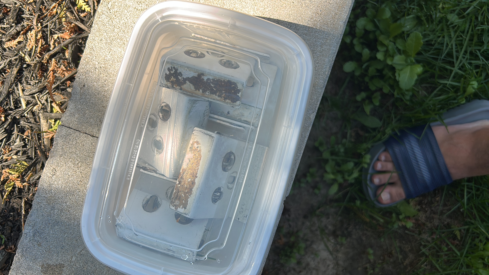

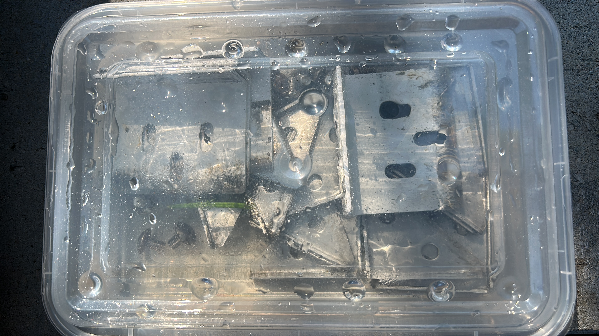

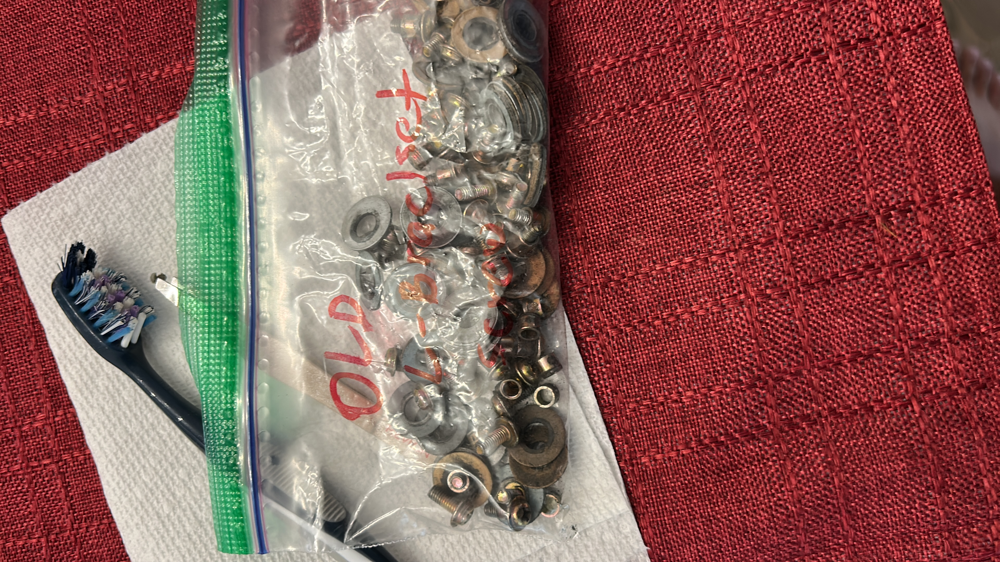

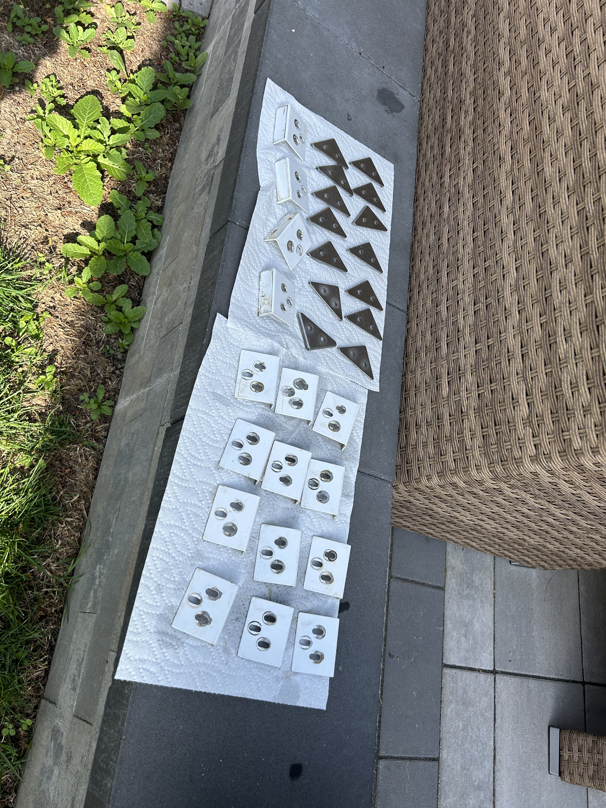

I'd also read about people counter-sinking their pad screws for a flatter surface. Spent another weekend researching specs and landed on low-profile M6 machine screws. Less mushroom head bulge under the panels. Small thing, but it adds up when you're trying to get the stage flat.

## Installing the mods

With clean brackets, I prepped the ddrpad foam inserts and L-bracket spacers on each one, then drilled everything back in and reattached the panel covers.

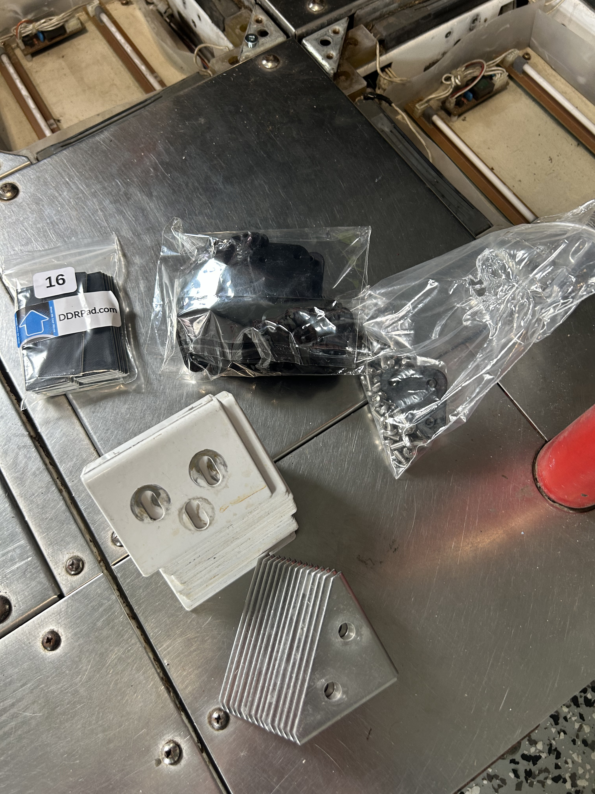

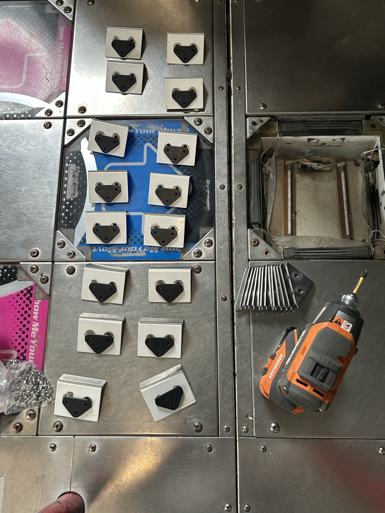

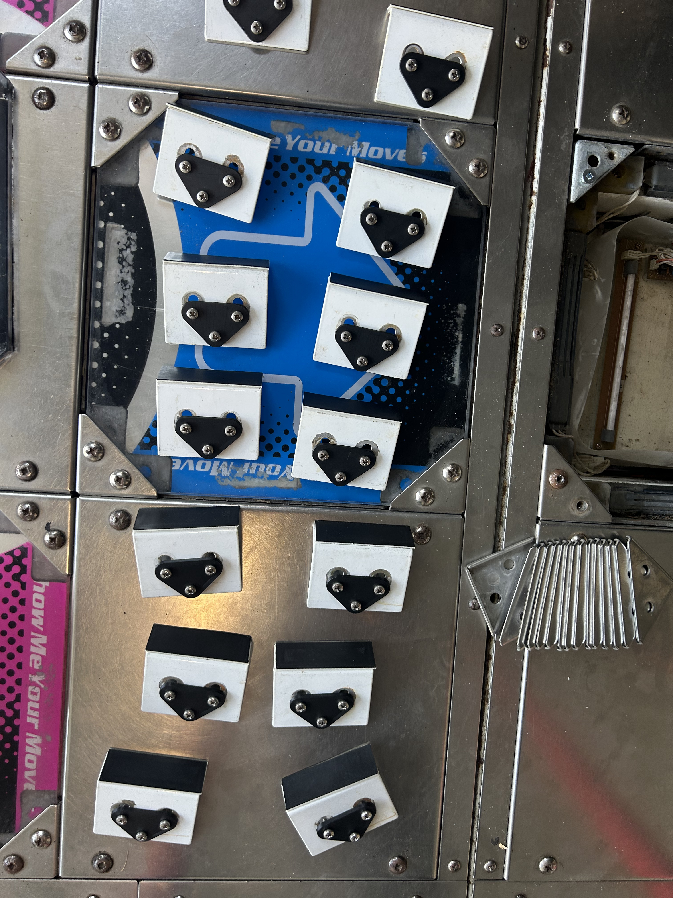

First test after reassembly: panels slid less, actuation felt firmer, sensors more responsive. Clear difference.

Then the whole thing again on the second pad. LOCK IN.

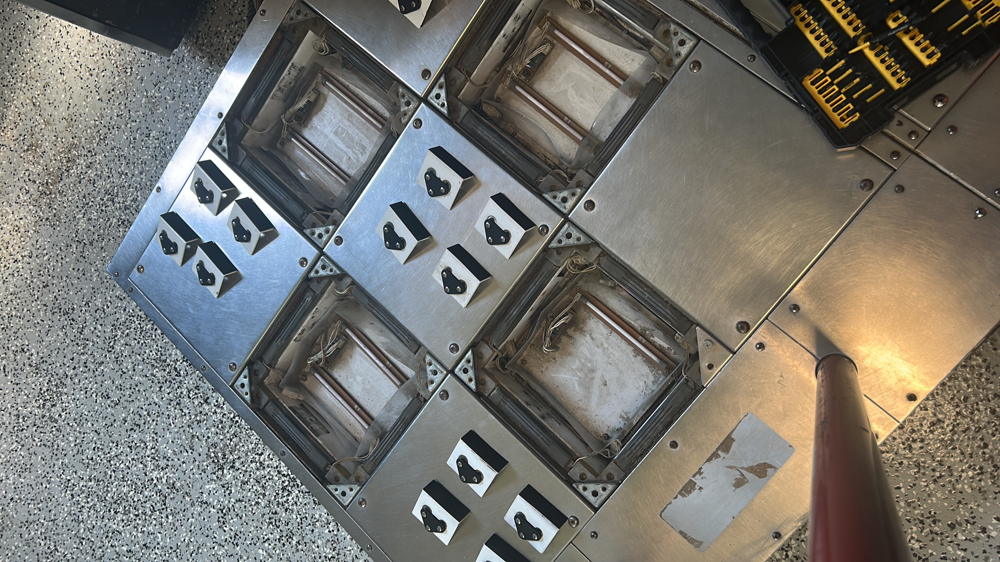

Having done it once helped, but it wasn't faster. Same stubborn screws, same slow cleaning and reassembly. At least I had a blueprint and most of the parts already sorted.

Piecemeal over about a month, both pads came out better. Less shift, firmer feel, plays the way I'd hoped when I ordered the parts. Also picked up some new tools and a lot more patience for twenty-year-old screws.

Shortly after, my brother-in-law helped me reattach the red support bars. Wish I'd documented that part. Another learning curve, though nowhere near as long. Maybe an hour all in.

By the end of it, the cab felt closer to what I remember playing on as a kid.

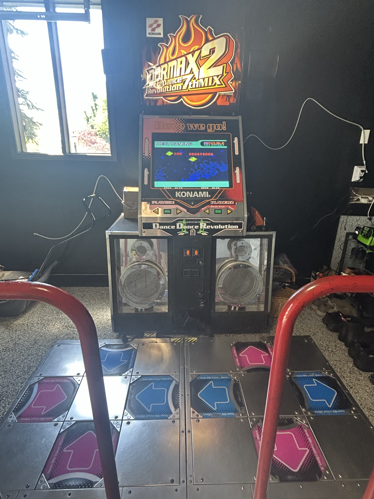

::: {.series-nav}

::: {.series-prev}
[Previous: Vol 3: Display Upgrades](../display-upgrades/)
:::

::: {.series-next}
[Next: Vol 5: Stepmania Upgrades](../stepmania-upgrades/)
:::

[All personal notes](../)

:::
