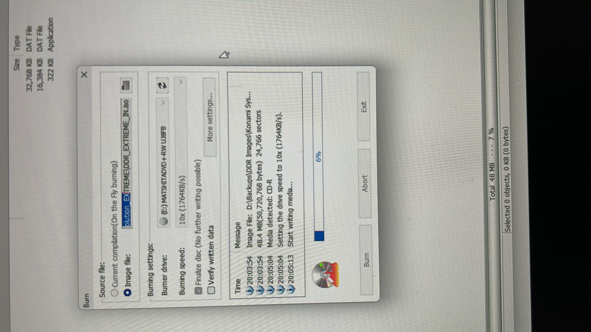
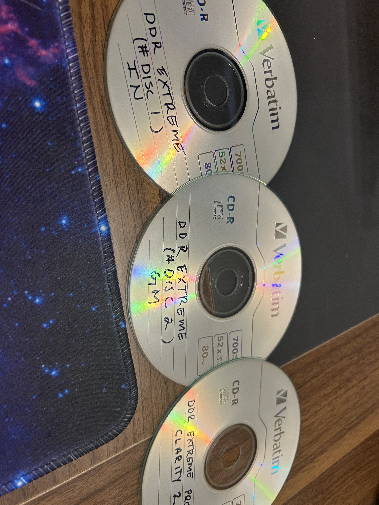
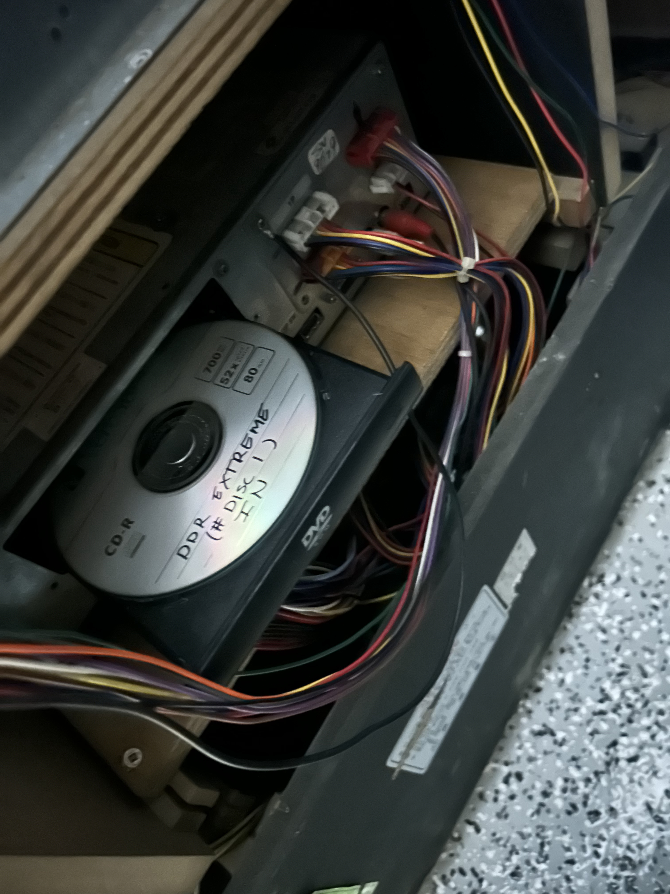
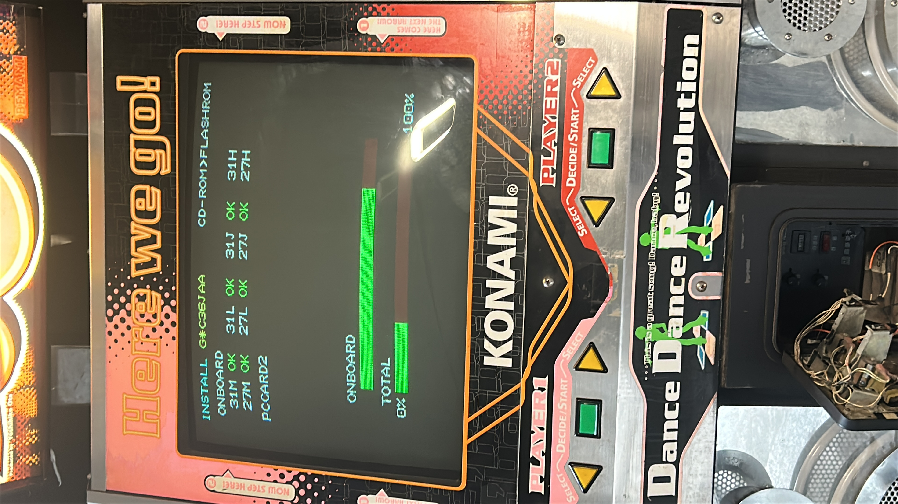
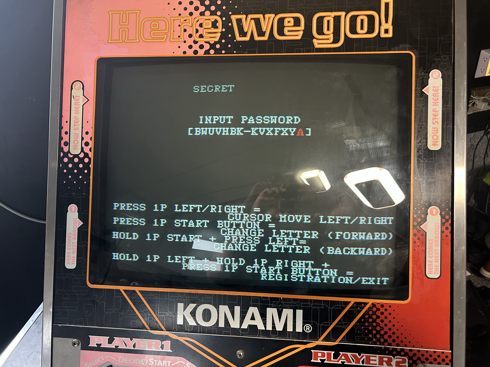
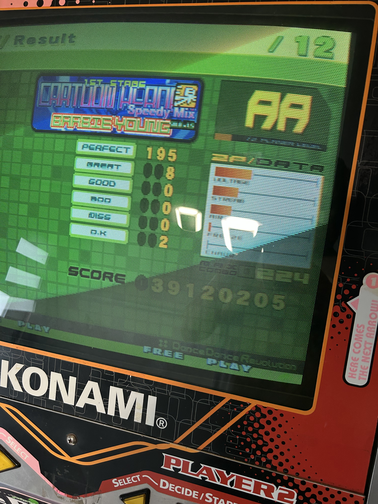
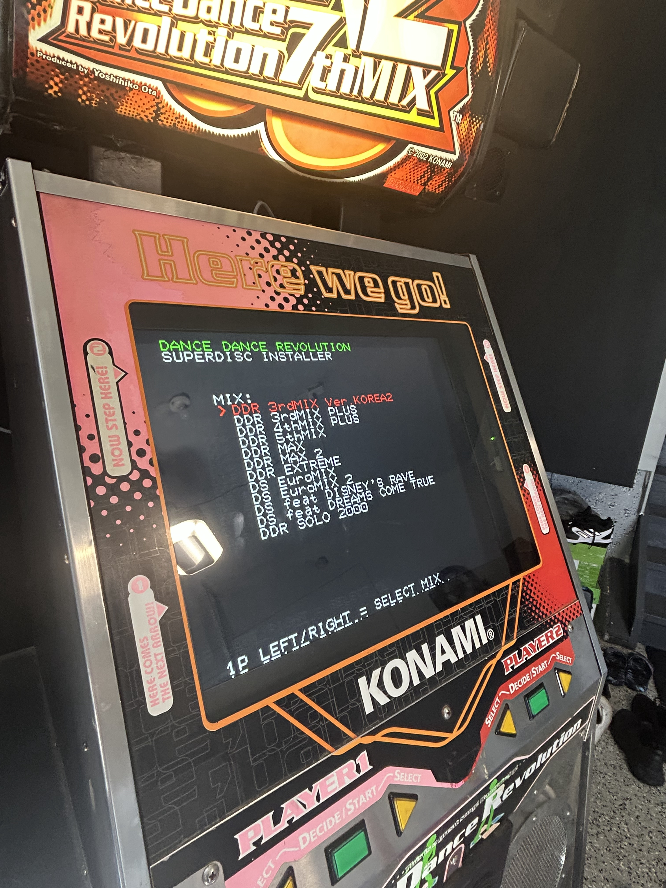
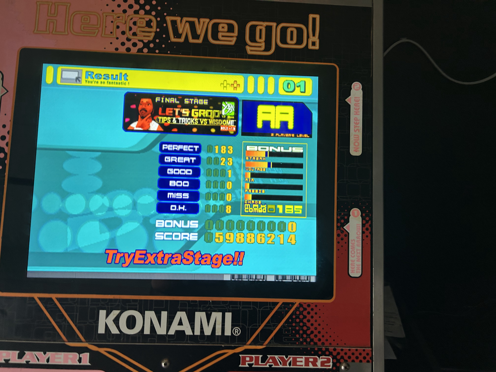

::: {.column-margin}
## What I bought

I didn't need much for this. The 573 already knew what to do — I just needed a way to burn the discs.

- [External CD DVD Drive, 0.5″ Ultra Slim USB 3.0 Type-C](https://www.amazon.ca/External-Optical-Portable-Recorder-Desktop/dp/B0F47M2Y6M)
- [Verbatim DVD-R 4.7GB 16x, 10-pack spindle](https://www.amazon.ca/VERBATIM-10-Pack-Spindle-Silver-43729/dp/B004H4W41I)
- [Verbatim CD-R 700MB 52x, branded surface, 50-pack spindle](https://www.amazon.ca/CD-R-700MB-52X-Branded-Surface/dp/B00029U1DK)
:::

The cab had been running for a little while with **DDRMAX 2**, which was great, but I obviously wasn't going to leave it there forever.

One of the things I wanted to figure out was how difficult it would be to actually swap DDR mixes on the System 573. It turns out it's completely doable. You just need the right discs, a way to burn them, and to get comfortable opening up the machine and messing around inside.

## Burning the discs

My first problem was that I didn't actually own anything capable of burning a CD.

Apparently laptops don't come with optical drives anymore.

So I picked up a little USB CD/DVD drive and some blank CDs. **DDR Extreme** needs two discs for the install on this hardware: an `IN` disc and a `GM` disc. I also burned another mix while I had everything set up.

Once they were done, I labeled them right away because there was absolutely no chance I was going to remember which disc was which later.

## Installing Extreme

The first time I opened up the cabinet to do this, I honestly had no idea what I was looking for.

There is the 573, the optical drive, a bunch of cables, and not much in the way of helpful instructions.

I thought the eject button wasn't working at first. Turns out the drive was just a little sticky.

Once I got the tray open, I put in the first Extreme disc.

The install process itself is pretty straightforward once you know the trick:

1. Turn the machine off.
2. Flip **dip switch 4** on.
3. Put in the install disc.
4. Turn the machine back on.

That boots the installer, which writes everything to the 573's flash memory.

After it finished, I turned everything off again, flipped dip switch 4 back, and rebooted.

And... it worked.

::: {.video-callout}

🎥 **Extreme installation and first boot**



:::

Seeing Extreme boot up on the machine for the first time was pretty cool. Attract mode worked, the song wheel worked, and most importantly, the pads were still working.

## Unlock codes

Of course, installing the game wasn't quite the same as having a fully unlocked arcade machine.

There are operator or "secret" unlock codes for these mixes that unlock additional songs. After digging around for the code for Extreme, I entered it on the SECRET / INPUT PASSWORD screen.

And that did it.

Cartoon Heroes (Speedy Mix), AA.

## Superdisc

At this point I realized I probably didn't want to keep burning individual discs every time I wanted to try another mix.

That's where the **superdisc** comes in.

Basically, it's a DVD with a bunch of compatible DDR mixes on it. You boot into the installer, pick the mix you want, and install it.

It makes trying different mixes way easier. The process is basically the same: flip dip switch 4, boot into the installer, pick a game, let it install, flip the switch back, and reboot.

I tried **5th Mix** next just to make sure I hadn't somehow gotten lucky with Extreme.

::: {.video-callout}

🎥 **DDR 5th Mix installed and running**



:::

Worked perfectly.

Then I switched over to **DDRMAX**, because apparently I now have the ability to casually swap DDR mixes whenever I feel like it.

That's probably one of my favourite things about owning this machine so far. It's the same cabinet sitting in my basement, but changing the software completely changes what I'm playing.

One night it's Extreme.

The next night it's MAX.

And apparently, if I really want to, I can install **DDR 3rd Mix Korea 2** for some reason.

::: {.series-nav}

::: {.series-prev}
[Previous: I bought a DDR machine](../ddr-machine/)
:::

::: {.series-next}
[Next: Display Upgrades](../display-upgrades/)
:::

[All personal notes](../)

:::