::: {.column-margin}
## What I bought

- [Snekboard (Ice Dragon)](https://icedragon.io/snek/)
- [Beelink SER5 mini PC](https://www.amazon.ca/dp/B0FHQ3G8KG)
- [EASYTONE mini wireless keyboard with touchpad](https://www.amazon.ca/dp/B07FNJT7ZK)
:::

Hardware mods were mostly done. LCD, pads, the cab playing well. Next idea I kept seeing: swap the 573 for a PC running StepMania.

The **Snekboard** makes that possible without cutting harnesses. Pad IO and lights plug into it like they did on the 573. USB-C goes to the PC. Audio runs from the cab receiver into the mini PC's headphone jack. Reversible in a few minutes.

```{mermaid}
flowchart LR
  subgraph cab["DDR cabinet"]
    pads["Pads and panel buttons"]
    lights["Cabinet lights"]
    amp["Cab audio receiver"]
  end

  subgraph bridge["Snekboard"]
    io["Pad IO and lights"]
  end

  subgraph pc["Mini PC"]
    sm["StepMania"]
    audio["3.5mm audio in"]
  end

  subgraph shelf["On the shelf optional"]
    konami["System 573"]
  end

  pads --> io
  lights --> io
  io -->|USB-C| sm
  amp -->|RCA red white| audio

  io -.->|same harnesses| konami
```

*Signal path for the StepMania swap.*

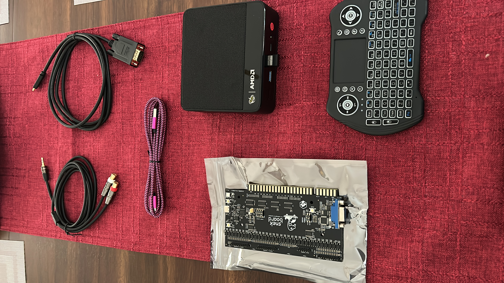

## Ordering parts

Snekboards are hard to find. When [Ice Dragon](https://icedragon.io/snek/) had stock, I ordered one to stash for later. Lasted about a week before I wanted to install it.

My brother-in-law helped spec a mini PC and plan the layout so the cab wouldn't become a PC tower with a marquee.

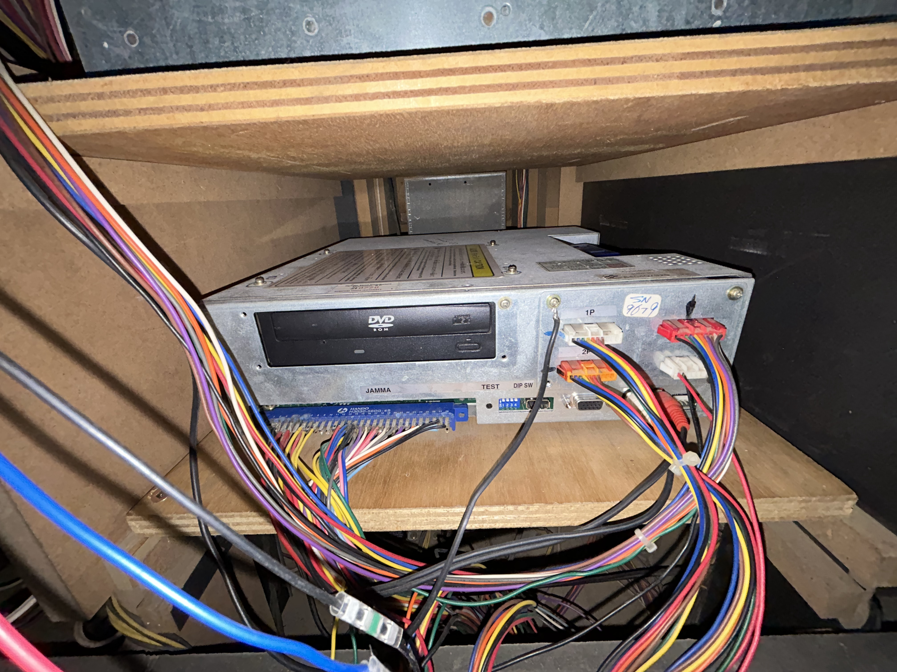

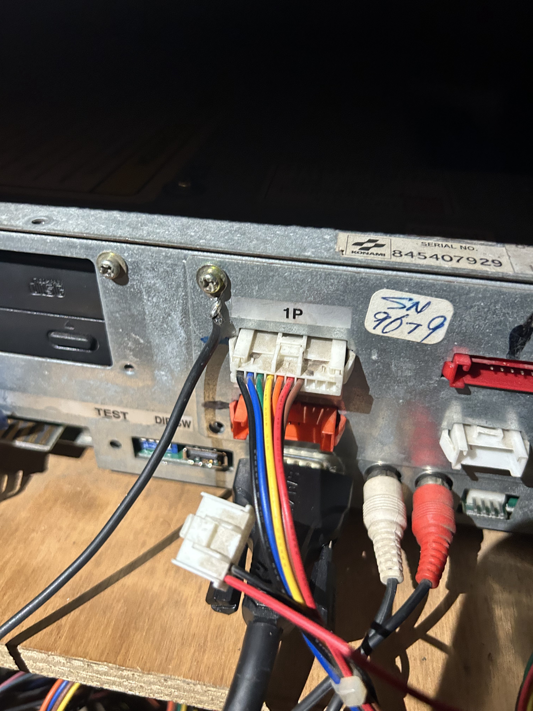

The Beelink is probably overkill for StepMania, but it's small, fits where the 573 lived, and leaves room for other uses. The 573 still works and sits on the shelf. After the CRT died, this felt like the next aging part worth planning around.

## Wiring it up

We photographed every 573 connection first, then followed Ice Dragon's guide. Same harnesses, just a different brain.

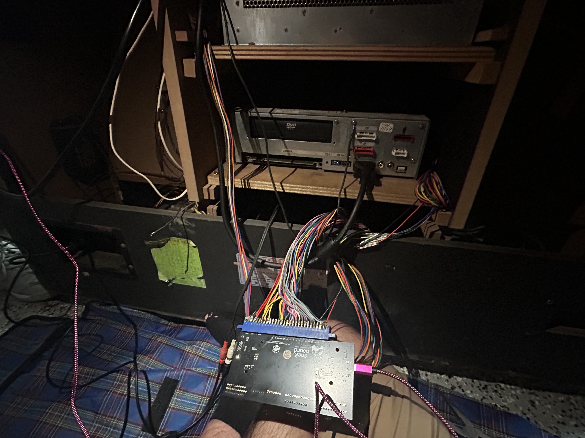

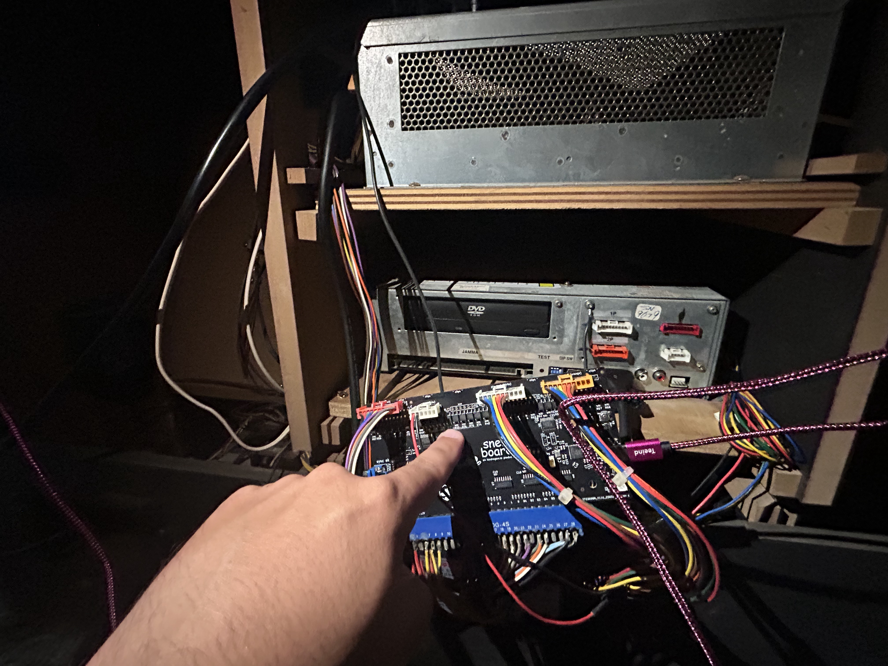

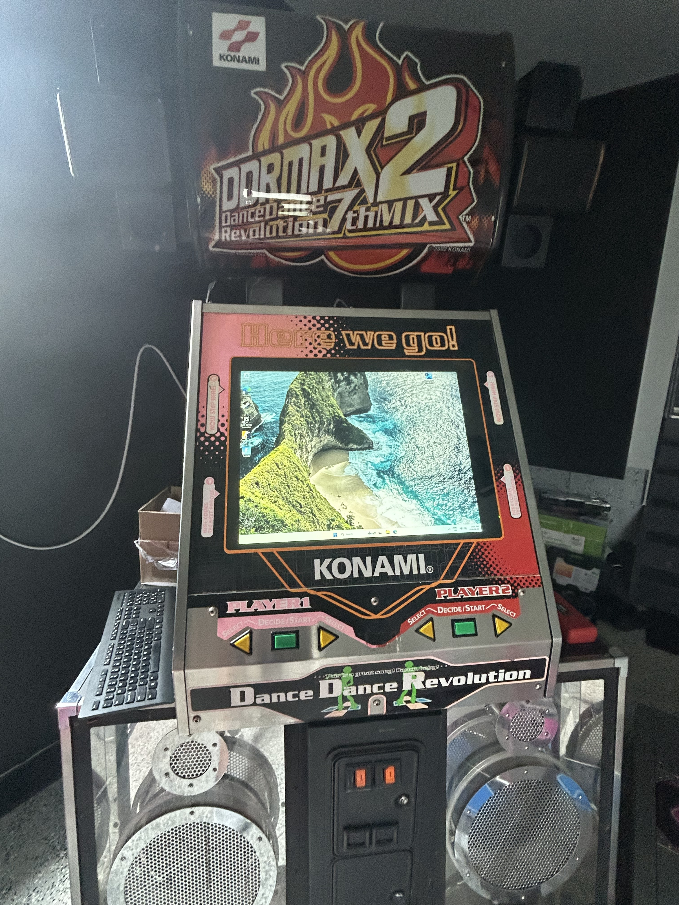

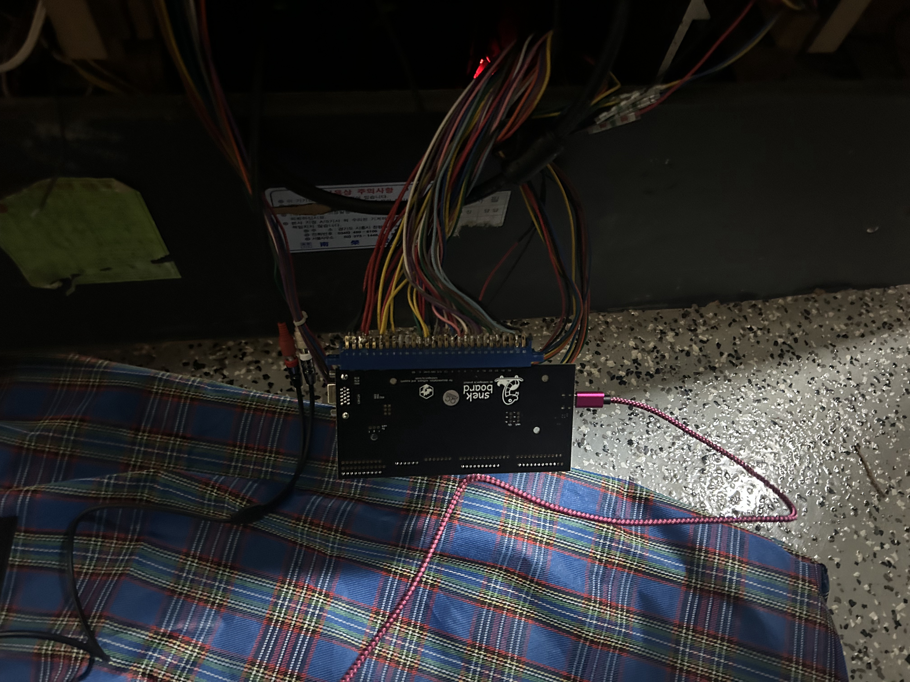

I'm running **BeWare's Extreme** mod, which is about as close to arcade-perfect DDR Extreme as I've seen at home. Getting the cabinet lights working took an extra step, covered in Ice Dragon's docs. Pads registered as USB right away. Mapping arrows and buttons in StepMania took some trial and error.

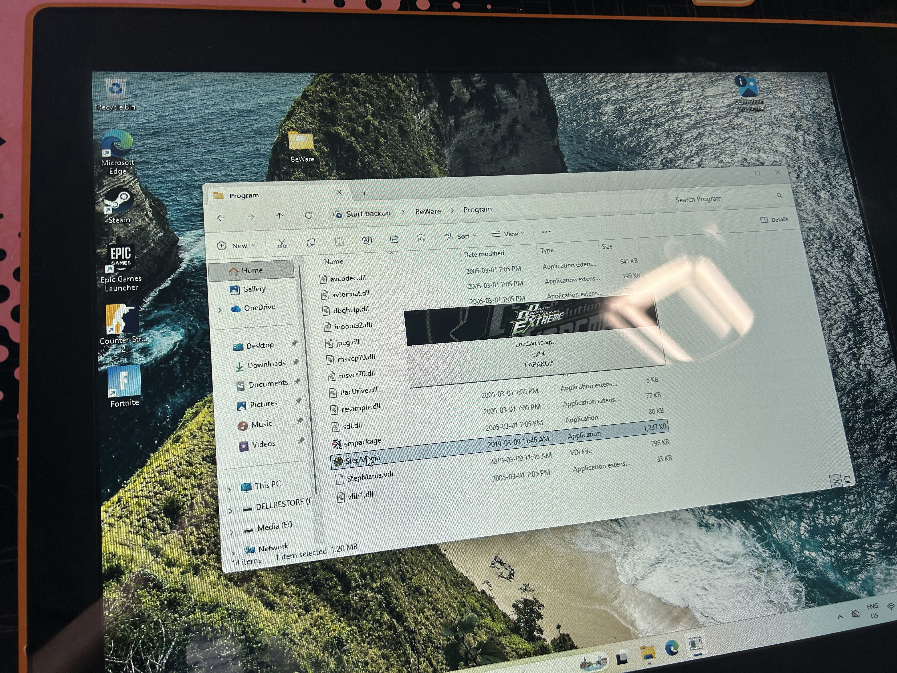

::: {.callout-note .video-callout icon="false"}

## BeWare StepMania on the cabinet



:::

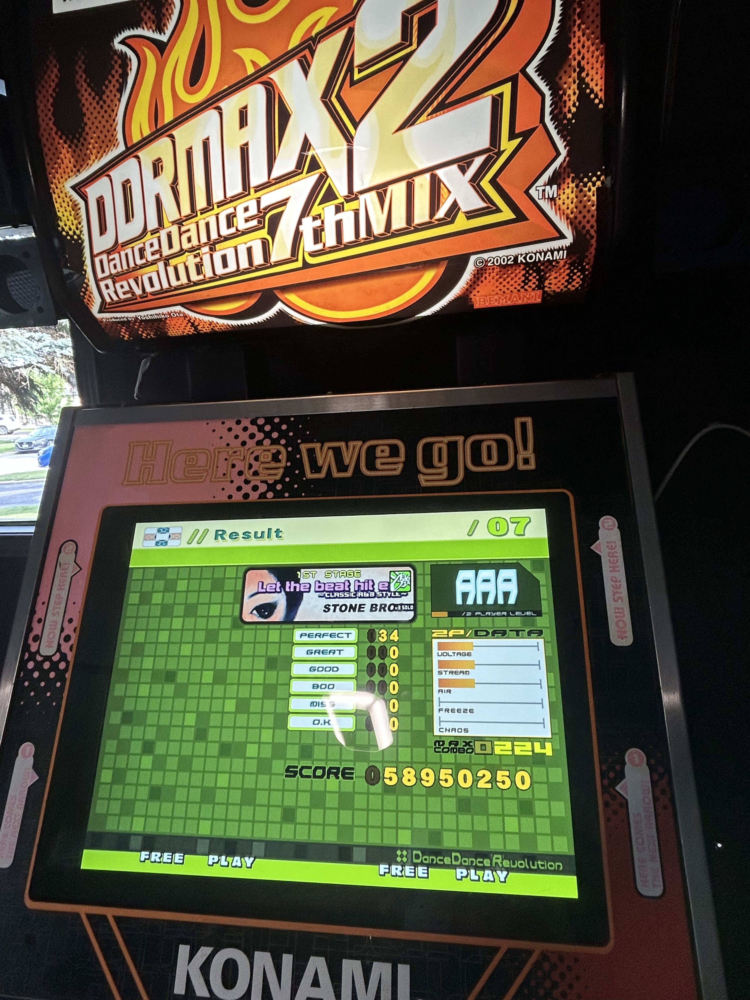

## What you can do with it

LCD, mini PC, pads as a USB controller: we had to try **Counter-Strike** and **Fortnite** on a DDR cab. Ridiculous. Worth it.

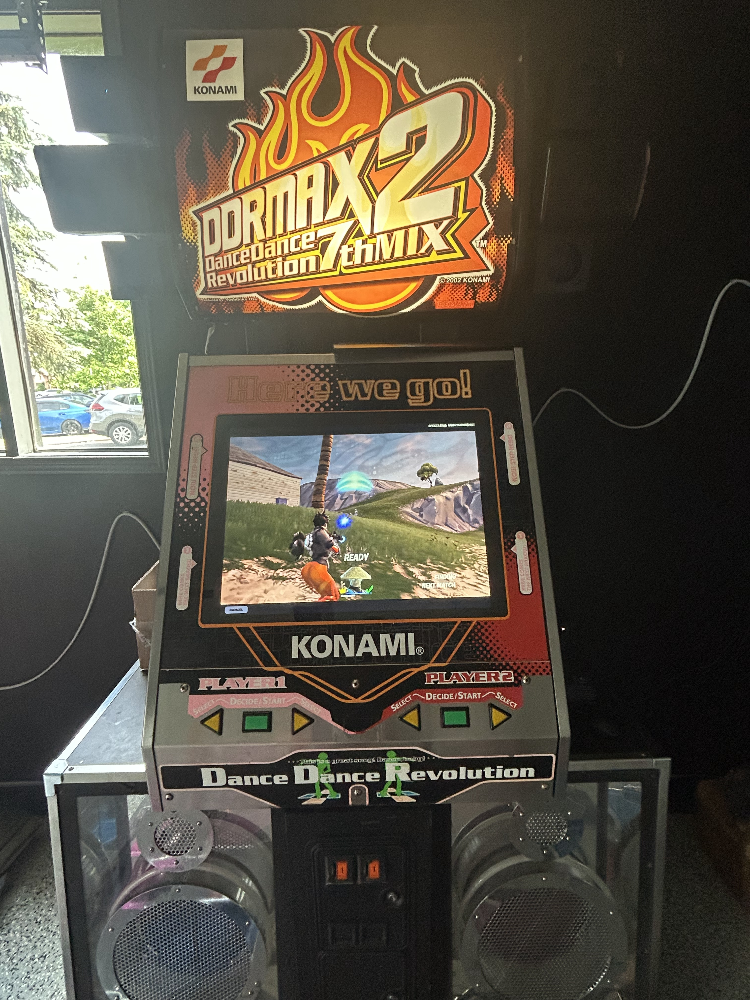

The real win is StepMania. Any mix, plus customs that look at home on the cab with BeWare.

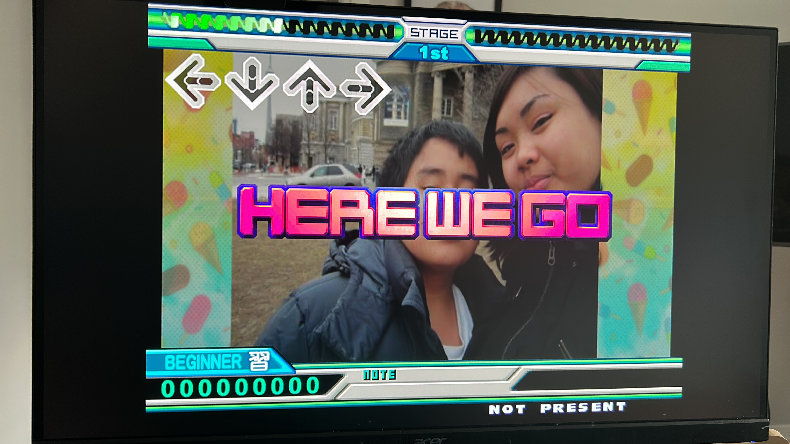

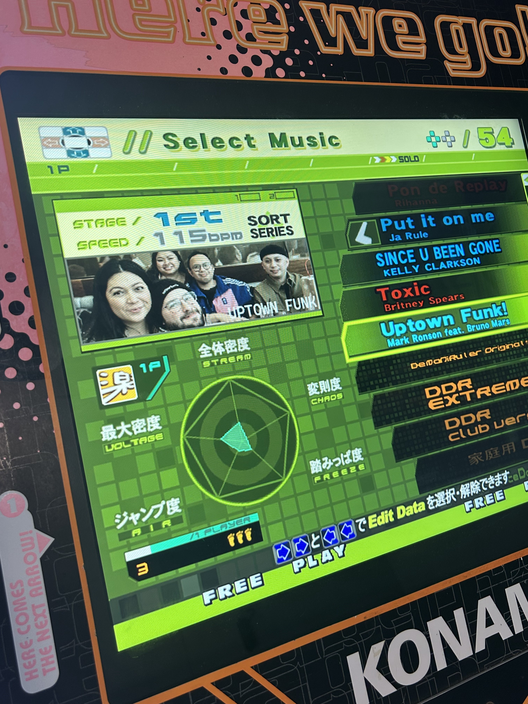

The whole thing feels next gen now: LCD, mini PC, custom software. Still plays like an arcade machine because it's still *this* cabinet. That's how it gets used now.

::: {.series-nav}

::: {.series-prev}
[Previous: Vol 4: Pad Upgrades](../pad-upgrades/)
:::

::: {.series-next}
:::

[All personal notes](../)

:::
