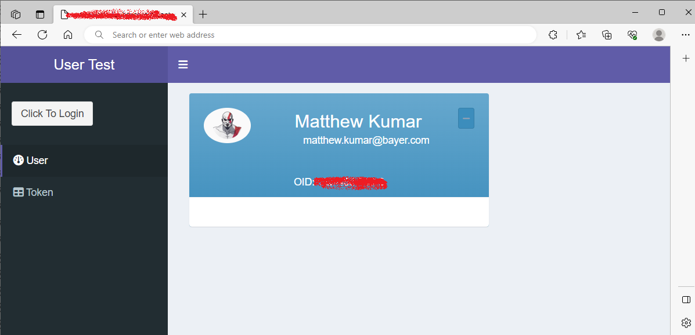

<h4>Preface</h4>

I'll preface with this post is related to a project I lead at work. I can't share too many details about it here unfortunately (including code), but what I can safely share is my experience and process 💡.

<h4>tl;dr</h4>

I lead the development of a medium-size shiny application that is used by users within my organization. This app has evolved to the state where I need to move it from the current platform to a platform that is capable of scaling 📈 and has storage 📁. How can I re-factor my existing app to integrate with this? Keep in mind, not only the access, but the <em>data access</em> too.🎯

<h4>First Steps</h4>

Until very recently, I had almost no experience with Azure or it's systems, or it's esoteric lingo 💬.My first step was to attempt to read test data (prepared by an engineer in a File Container) into my local R. I'll ⏭️ the details of this setup, mostly because I don't quite understand all that the Azure DevOps Engineers️ 👨‍🔧 had to configure, but also my scope is restricted to R and shiny in this post.

I looked into the `AzureStor` package because by it's description alone, it's what I was going to need to do: Access files from Azure Storage. Straight forward right 🤷‍♂️? Not exactly ❌.

It turns out I needed to use the `AzureAuth` package first, whose sole focus is on establishing authentication with services on Azure using Active Directory. OK, so game plan. Use `AzureAuth` to "connect", get a token 🌕, then pass it to functions in `AzureStor` to do operations like read/write/list. Once I could do this, I was confident my app would work in it's entirety. ✔️

This task in reality took quite a bit of time to map 🕵. Remember, I don't speak Azure. I also don't expect the DevOps engineers 👷 to be familiar with this R package nor support it. Enter growing pains 😭 🏋️‍♀️ 👨‍🔧.

In the end we did get it mapped out, some parameters / settings more obvious than others, and I could finally read Azure File Containers hosted on the platform in my local R instance. 🎉

Here is the function I used:

`AzureAuth::get_azure_token(resource,   tenant,   app,   password = NULL,   username = NULL,   certificate = NULL,   auth_type = NULL,   aad_host = "https://login.microsoftonline.com/",   version = 1,   authorize_args = list(),   token_args = list(),   use_cache = NULL,   on_behalf_of = NULL,   auth_code = NULL,   device_creds = NULL )`

<h4>Shiny</h4>

Oh man, you would think just because you can produce something in a local R session, you can throw it into a shiny app and have it work right? right? Wrong ❌.. That was a learning here.

I'll mention too that on this new platform, we've chosen to use Posit Connect to host our shiny apps going forward. This product is definitely new to the DevOps team and while I have experience deploying apps to it, I don't have experience in configuring it. 😶.

Some weeks later, the connect server was setup, and I could deploy hello world apps to it from my local R instance. I could actually deploy my full app, but it essentially didn't do anything since I didn't re-factor the data connectivity. Small victories. 🏁

<h5>Hello App, with Azure</h5>

Our first task was to setup any kind of hello world shiny app that could read the files stored in the Azure file container. We eventually got this to work by using the <strong>app-password</strong> (defined in the link above). This was a reassuring sign of being on the right track ☀️. But what we really needed was to use the <strong>user</strong> 👥 credentials (since they will be tied to data access within the app). This was a lot more challenging, but an absolute necessity given what my app does.📝

I'll say this vignette was [super-helpful](https://cran.r-project.org/web/packages/AzureAuth/vignettes/shiny.html) <em>in theory</em>, but a lot of the pains ⌛ were configurations specific to <strong>our companies internal systems</strong> 👨‍💻

<h5>Hello Matt, with Azure</h5>

I tried for the life of me to get the app to pull <strong>my</strong> credentials with no luck. Relying on the app-password was just a non-starter for this project. Enter `AzureGraph` 🌄

We had Microsoft Graph setup in our Azure system. In the end, after many hours of googling (GPT-4 was not helpful here) and experimenting, I was able to get it working locally. <em>Two steps forward, one step back.</em> In the end, I managed to integrate the Graph work flow into a shiny app ✔️.

This is what I did:

-   request a token 🌕️ using Microsoft Graph service. This toke️n <strong>did</strong> contain my user creds
-   clone that token for use in another Microsoft Service, namely Azure Storage
-   pass that token when listing/reading/writing files in Azure using `AzureStor` within the shiny app ↪️
-   ❓️❓️❓️
-   Profit 🤑.

It worked.

Below is the culmination of many hours and weeks of learning about Azure, and it's integration into R and Shiny, with the added complexity of our companies systems/policies. 😝😝😝

In the above, I have a simple dashboard with a user card displaying credentials. What's really neat is that since SSO is enabled, I only really need to click a button to actually get a token using the chain of events defined above. What's this mean?

\<em\>User's don't really have to "login" anymore 🔓. Even better, because the storage is setup and the ACL maintained, users only see what they are supposed to see. No more manual setups ☑️ ...at least from my end and from the perspective of Shiny.\</em\>

Okay that's it. I just want to also say I've learned so much from working with the Azure folks 💪🏻; really I have 🙏. They were super patient with me, and really took the time to explain micro-concepts (much of which abbreviated here or skipped for brevity).

👉[Here](https://github.com/Azure/AzureR)👈 is a nice link to the Azure\* Ecosystem of R Packages. All sorts of useful stuff for interacting with Azure, Sharepoint and lots of other services:

Till next time, 🍻🥂🥃
