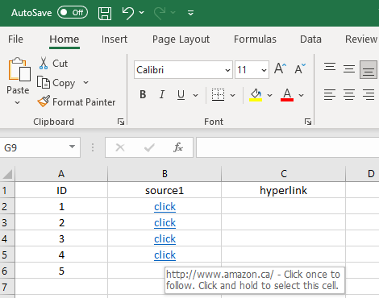

A prototype I was working on earlier this year needed to make use of data stored in an excel book. The data I needed were the **URLS embedded in hyperlinks** within cells of a sheet.



The cells in column B contain hyperlinks for which I need to extract out the URLs. For example, cell B4 has the value of: `http://www.amazon.ca/`. This is what I need access to. 

I figured one of the existing R packages that could extract this information. I checked the usual: `readxl`, `xlsx`, and `openxlsx` and was surprised that none could. 

My next thought was to just have the URLs extracted in Excel, prior to reading them into R. Surely this was possible, right? Not without using a VBA macro. 🤢 I gave this an honest shot and it proved too cumbersome. No thanks. 

I read that it might be possible in Python with the `openpyxl` package. I haven't a whole lot of experience with Python. I've been reading and hearing how easy it is to [use Python within R and RStudio](https://rstudio.github.io/reticulate/). I decided to give a go. Enter `reticulate`. 🐍🐍🐍

The example that follows can be broken down into a few steps:

1. Install reticulate and figure out how it works
2. Install python packages (`openpyxl`, `pandas`) within RStudio and figure out how *they* work
3. Integrate everything into a simple workflow
4. ❓️❓️❓️
5. Profit

Getting setup was actually the easy part. At least on my windows machine.

```{r echo=TRUE, eval=FALSE}
# install reticulate
install.packages("reticulate")

# install a python distribution on my machine
reticulate::install_miniconda

# install python packages
reticulate::py_install('pandas')
reticulate::py_install('openpyxl')
```

Next was actually figuring out how to use these packages. After a fair bit of reading documentation and tinkering, I was able to come up with the following function I've named `get_hyperlink.py`.

```{.python}
import openpyxl as xl
import pandas as pd

def get_hyperlink(path, sheet):

  # Define workbook, worksheet
  wb = xl.load_workbook(path)
  ws = wb.get_sheet_by_name(sheet)
  
  # For all cells in the worksheet, if a hyperlink is detected:
  # 1. Extract the hyperlink target
  # 2. Otherwise just keep the original value as a string
  for row_cells in ws.iter_rows():
    for cell in row_cells:
      try:
        cell.value = cell.hyperlink.target
      except:
        cell.value = str(cell.value)
    
  # Store values to a data frame, clean up headers 
  tmp = pd.DataFrame(ws.values)
  tmp.rename(columns = tmp.iloc[0], inplace = True)
  tmp.drop(tmp.index[0], inplace = True)
  
  return tmp
```

At this point, what's left is integrating the python script into an existing R workflow so that I can actually use it.

```{r, eval = FALSE, echo = TRUE}
library(reticulate)

# Load python function
source_python("get_hyperlink.py")

# Use python function
my_data <- get_hyperlink(path = "input.xlsx", sheet = "Sheet1")
```

The results:
```{r, eval = FALSE, echo = TRUE}
head(my_data)
```

And that's a wrap! ✅🏁🍻


Actually, there's one other feature of the `reticulate` package I want to share. If you're new to Python like I am, it's helpful to be able to tinker in a REPL (**read-eval-print-loop**) fashion. Calling `reticulate::repl_python()` provides one directly in your R session so you can tinker more naturally. 💪 
