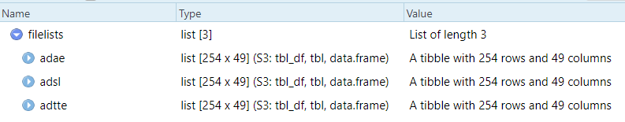
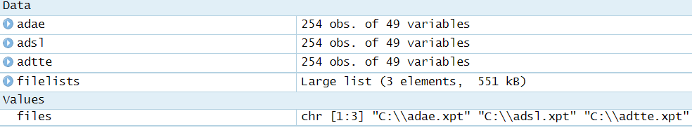

I feel like there are countless examples on how to read a directory of .csv files into R using `purrr` 😺. However, in those examples the setup is potentially many CSV files being read in <strong>and stacked into a single data frame</strong>. 

What if we need to read several .csv (or other types) data files into <em>their own data frame</em>❓️💡 

In my own work, this is an operation I typically do. Until recently, I haven't bothered how to figure this out in `purrr`. Don't ask how I was doing it before. 🤢

Here's a small snippet that will demonstrate how to use `purrr::pmap()` to perform this operation. Instead of .csv files, we'll read in .xpt (SAS Transport) using `haven::read_xpt()`


## Step 1
Let's first identify the relevant files we want to read in using `list.files()` and store this as a character vector. 
```{r, eval = FALSE, warning = F, message = F}
library(purrr)
library(dplyr)

files <- list.files("C:\\", pattern = "*.xpt", full.names = TRUE)

# preview
files
```


## Step 2
Next, for each element of the files character vector, we'll read in the corresponding file using a combination of `purrr::map` and `haven::read_xpt`. This will result in a list where each element corresponds to a tibble of the respective xpt file. At the sometime, we'll attach the name to each element using `purrr::setnames` so we can identify what's what.
```{r, eval = F}
filelists <- files %>%
  map(., haven::read_xpt) %>%
  set_names(files %>% basename(.) %>% tools::file_path_sans_ext(.))
```

Here's what `filelists` looks like in R Studio:



## Step 3
Here's the cool part. Let's use `purrr::pmap()` and `assign()` to make a separate data frame for it in the global environment. We start by specifying .x to be the list of files and .y to be the names of the files. With these two inputs, we need to simply map them to a single `assign()` call and we're done.💯
```{r, eval = F}
purrr::pmap(.l = list(.x = filelists, .y = names(filelists)),
            .f = ~assign(.y, .x, envir = globalenv()))
```

Here's what my global environment looks like in R Studio:




Till next time 🍻🙏 !
