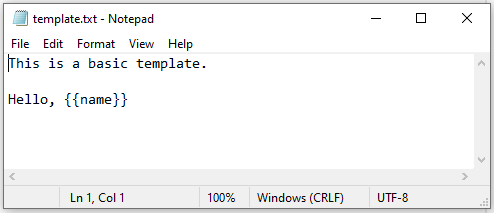
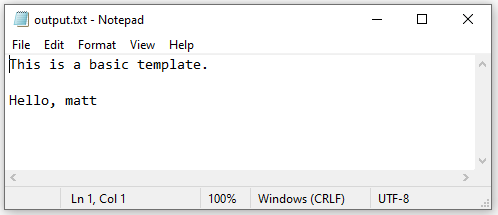

I recently came across the `whisker` 📦, which is an R implementation of [{{mustache}}.](https://mustache.github.io/) Say what 👨?

> ... a logic-less template syntax. It can be used for HTML, config files, source code - anything. It works by expanding tags in a template using values provided in a hash or object.

If you've authored either Rmarkdown documents or shiny apps (using [HTML templates](https://shiny.rstudio.com/articles/templates.html)) chances are this will feel familiar. ✅

In a [previous post](https://matt-kumar.netlify.app/project/rmarkdown-reporting-engine/), I described a templating strategy to automatically generate patient profiles within a clinical trial context. Where as this strategy relied on Rmarkdown and *actual R code* to produce the per-patient summaries, the `whisker` approach is far more generic. 

It's also *really* easy to get started with. 🏁 

1.  Create a generic template file with a placeholder for your content enclosed in `{{}}`
2.  Read the template into R
3.  Assign your content using placeholder name
4.  Write the results back

I'll demonstrate with a simple template I've made in notepad.



Now, in R we can do the following:
```{r, warning = F, message = F, error = F, eval = F}
library(whisker)

# read in template
my_template <- readLines('template.txt')

# assign {{name}} to be "matt"
data <- list(name = "matt")

# write the results back
whisker.render(my_template, data = data) |>
  writeLines("output.txt")
```

Here is the result of the output


So what? Is this just a glorified search and replace functionality? 🤷️ No.

This is actually quite powerful when you start to think of the applications 🤔. ️️💡 Consider a complete R script as a "template"️. Something you tend to reuse in your work time to time. With `whisker` you can easily populate these templates and actually generate R (or other languages) scripts that can be executed **as is**. 

Still not convinced? Okay, think about how you could share some of this 💪 with your end users in the form a shiny app! ✌🍻
